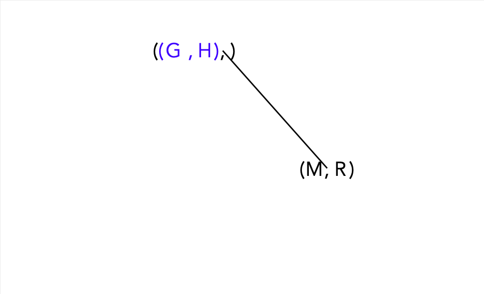
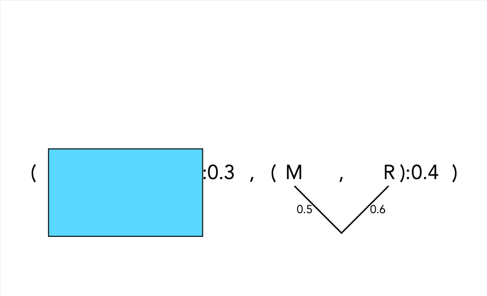

```{r setup, include=FALSE, cache=FALSE}
# set working directory to docs folder
#setwd(here::here("docs"))
# rmarkdown::render('Pres0.Rmd', 'xaringan::moon_reader')

# Set global R options
options(htmltools.dir.version = FALSE, servr.daemon = TRUE)

# Set global knitr chunk options
knitr::opts_chunk$set(
  fig.align = "center", 
  cache = TRUE,
  error = FALSE,
  message = FALSE, 
  warning = FALSE, 
  collapse = TRUE 
)

# xaringanExtra
library(xaringanExtra)
use_tile_view() 
use_share_again()
style_share_again(share_buttons = c("none"))

library(RefManageR)
BibOptions(check.entries = FALSE,
           bib.style = "authoryear",
           cite.style = "authoryear",
           style = "markdown",
           hyperlink = FALSE,
           dashed = FALSE)
bib <- ReadBib("biblio/bib.bib", check = FALSE)
```

class: title-slide

<br>
.font200[.f700[Phylogenetic trees]]<br>
.font120[Quick tutorial]

<br>
<br>
.marco[
Marco Chiapello
<br>
22 December, 2020
]

---
class: clear

<br><br>
# .black[.font200[Agenda]]

- Common phylogeny terminology, concepts and tools

- An example tree

---

layout: true
# Common phylogeny terminology, concepts and tools

---

## What is a phylogenetic tree?

.par30[
A phylogenetic tree or evolutionary tree is a branching diagram or "tree" showing the evolutionary relationships among various biological species or other entities
]

---

```{r echo=FALSE, out.width="800px"}

```

---

```{r echo=FALSE, out.width="800px"}
knitr::include_graphics("images/15.48.57.png")
```

---

## Which of these topologies are the same?

```{r echo=FALSE, out.width="1000px"}

```

---

## Rooting trees
```{r echo=FALSE, out.width="800px"}

```

---

## Branch lengths
```{r echo=FALSE, out.width="800px"}

```

---

```{r echo=FALSE, out.width="800px"}

```

---

## Common representations
```{r echo=FALSE, out.width="800px"}

```

---

```{r echo=FALSE, out.width="800px"}

```

---

```{r echo=FALSE, out.width="800px"}

```

---

## Newick format

.par30[
- A string describing tree topology and branch lengths
- Popular input and output format for phylogenetic software
- Example: (A:1,D:6,(((E:1,F:1):1,B:2):1,(C:4,G:2):2):1);
<br><br>
https://en.wikipedia.org/wiki/Newick_format
]

---

```{r echo=FALSE, out.width="800px"}

```

---

```{r echo=FALSE, out.width="800px"}

```

---

```{r echo=FALSE, out.width="800px"}

```

---

```{r echo=FALSE, out.width="800px"}

```

---

```{r echo=FALSE, out.width="800px"}

```

---

```{r echo=FALSE, out.width="800px"}

```

---

```{r echo=FALSE, out.width="800px"}

```

---

```{r echo=FALSE, out.width="800px"}

```

---

```{r echo=FALSE, out.width="800px"}

```

---

```{r echo=FALSE, out.width="800px"}

```

---

```{r echo=FALSE, out.width="800px"}

```

---

```{r echo=FALSE, out.width="800px"}

```

---

```{r echo=FALSE, out.width="800px"}
knitr::include_graphics("images/15.56.04.png")
```

---

```{r echo=FALSE, out.width="800px"}

```

---

```{r echo=FALSE, out.width="800px"}

```

---

```{r echo=FALSE, out.width="800px"}

```

---

```{r echo=FALSE, out.width="800px"}

```

---

```{r echo=FALSE, out.width="800px"}

```

---

```{r echo=FALSE, out.width="800px"}

```

---

```{r echo=FALSE, out.width="800px"}

```

---

```{r echo=FALSE, out.width="800px"}

```

---

```{r echo=FALSE, out.width="800px"}

```

---

```{r echo=FALSE, out.width="800px"}

```

---

```{r echo=FALSE, out.width="800px"}

```

---

```{r echo=FALSE, out.width="800px"}

```

---

```{r echo=FALSE, out.width="800px"}

```

---

```{r echo=FALSE, out.width="800px"}

```

---

```{r echo=FALSE, out.width="800px"}
knitr::include_graphics("images/15.57.41.png")
```

---

```{r echo=FALSE, out.width="800px"}

```

---

```{r echo=FALSE, out.width="800px"}

```

---

## Which sites are related?

```{r echo=FALSE, out.width="800px"}

```

---

## Differences indicated by an alignment
```{r echo=FALSE, out.width="800px"}

```

---

## Alignment for phylogenetics
```{r echo=FALSE, out.width="800px"}
knitr::include_graphics("images/17.24.30.png")
```

---

## Columns in alignments should be homologous
```{r echo=FALSE, out.width="800px"}

```

---

## There is only one true tree
```{r echo=FALSE, out.width="800px"}

```

---

## Methodological approaches

.par30[
1. Distance matrix methods (pre-computed distances)
	- UPGMA	assumes perfect molecular clock Sokal & Michener (1958) 
	- Minimum evolution (e.g. Neighbour-joining, NJ) Saitou & Nei (1987)
1. Maximum parsimony Fitch (1971)
	- Minimises number of mutational steps 	
1. Maximum likelihood, ML
    - Evaluates statistical likelihood of alternative trees, based on an explicit model of substitution
1. Bayesian methods
    - Like ML but can incorporate prior knowledge
]

---

## Methodological approaches

.par30[

1. .opacity10[Distance matrix methods (pre-computed distances)]
	- .opacity10[UPGMA	assumes perfect molecular clock Sokal & Michener (1958) ]
	- .opacity10[Minimum evolution (e.g. Neighbour-joining, NJ) Saitou & Nei (1987)]
1. .opacity10[Maximum parsimony Fitch (1971)]
	- .opacity10[Minimises number of mutational steps]
1. Maximum likelihood, ML
    - Evaluates statistical likelihood of alternative trees, based on an explicit model of substitution
1. .opacity10[Bayesian methods ]
	- .opacity10[Like ML but can incorporate prior knowledge ]
]

---
