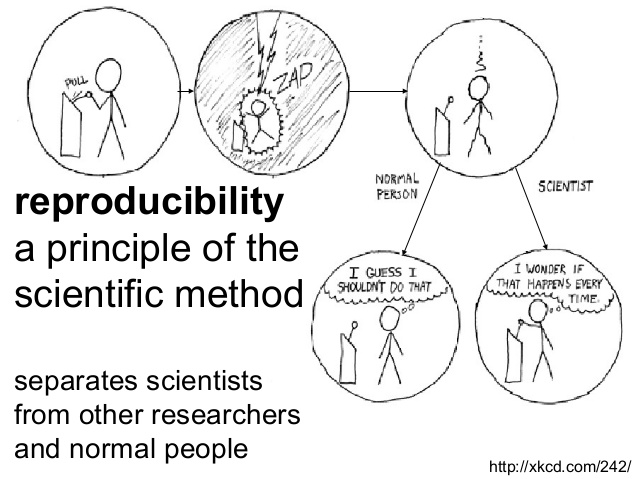
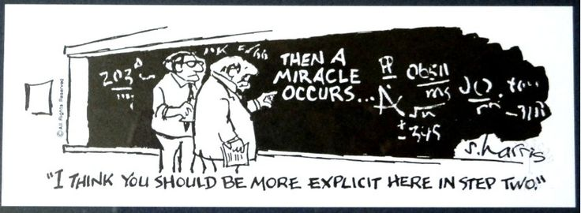
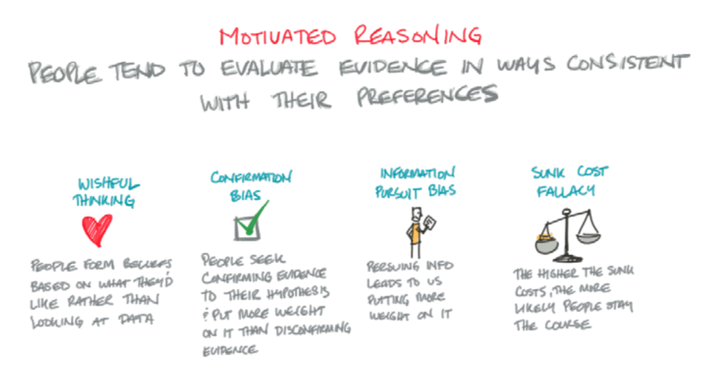
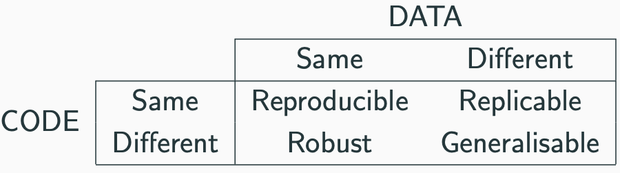

```{r setup, include=FALSE, cache=FALSE}
# set working directory to docs folder
#setwd(here::here("docs"))

# Set global R options
options(htmltools.dir.version = FALSE, servr.daemon = TRUE)

# Set global knitr chunk options
knitr::opts_chunk$set(
  fig.align = "center", 
  cache = TRUE,
  error = FALSE,
  message = FALSE, 
  warning = FALSE, 
  collapse = TRUE 
)

# xaringanExtra
library(xaringanExtra)
use_tile_view() 
use_share_again()
style_share_again(share_buttons = c("none"))

library(RefManageR)
BibOptions(check.entries = FALSE,
           bib.style = "authoryear",
           cite.style = "authoryear",
           style = "markdown",
           hyperlink = FALSE,
           dashed = FALSE)
bib <- ReadBib("biblio/mybib.bib", check = FALSE)
```


class: title-slide


# .font170[Data science in Unix and R]
## .font150[Reproducible Research]


<br><br>
.marco[
.tada[Marco Chiapello]
<br>
2020-12-15
]


.marco[
.center[.font90[[[`r fontawesome::fa("slack", fill = "steelblue")`](https://join.slack.com/t/ipma-2020/shared_invite/zt-j9o8ig7k-LN1~U3d6QJztquYbC6iW7w) Slack - `r fontawesome::fa("envelope", fill = "steelblue")`](mailto:marco.chiapello@unito.it) marco.chiapello@unito.it]
]
]


---

# PhDToolbox Course

```{r ds-class-options, echo=FALSE, out.width = "1100px"}
knitr::include_graphics("images/environmental-data-science-r4ds-general.png")
```

---
# What reproducible research is

```{r fulmine, echo=FALSE, out.width = "750px"}

```

???
thunderstruck
---
# What reproducible research is

```{r miracle, echo=FALSE, out.width = "750px"}

```

This is exactly how it seems when you try to figure out how authors got from a large and complex data set to a dense paper with lots of busy figures.
Without access to the data and the analysis code, a miracle occurred.

.content-box-orange2[
.white[
.center[
.font90[There should be no miracles in science `r Cite(bib, author = "Markowetz")`]
]
]
]

---
# What reproducible research is
.center[
.font200[DATA + ANALYSIS `r fontawesome::fa("arrow-right", fill = "black")` RESULTS
]
]

--
.center[
.font200[BUT not like this
]
]

---

# What reproducible research is

```{r motivate, echo=FALSE, out.width = "1200px"}

```

---
# What reproducible research is
.center[
.font200[DATA + ANALYSIS `r fontawesome::fa("arrow-right", fill = "black")` RESULTS
]
]

## Common practice of writing statistical reports:
.font150[
- We import a dataset into .red[Excel]
- Run a procedure to get all results
- .blue[Copy and paste] selected pieces into a typesetting program (usually .red[Word])
- Add a few descriptions
- Finish a report
]

---
# What reproducible research is

## There are obvious dangers and disadvantages in this process:
.font160[
1. It is .bold[error-prone] due to too much manual work;
2. It requires lots of human effort to do .bold[tedious jobs];
3. The workflow is barely recordable, therefore it is .bold[difficult to reproduce];
4. A .bold[tiny change] of the data source in the future will require the author(s) to go through the same procedure again;
5. The analysis and writing are separate, so close attention has to be paid to the .bold[synchronization of the two parts].
]

---
# What reproducible research is

.center[.font200[What is Reproducible Research?]]
<br>
.center[.content-box-red[.font150[.bold[The ability to reproduce someone else results]]]]
<br>

--

----

### What do you need?

--
.par26[
- Data

- Code

- Documentation for data and code
]


---
# What reproducible research is
## Reproducible vs Replicable


```{r tab1, echo=FALSE, out.width = "1200px"}

```
<br><br><br>
.marco[
Ref: https://github.com/KirstieJane/ReproducibleResearch
]
---
# What reproducible research is
.font120[
.bold[Reproducibility/reproduce]   
A study is reproducible if there is a specific set of computational functions/analyses (usually specified in terms of code) that .red[exactly reproduce all of the numbers in a published paper from raw data].

.bold[Replication/replicate]    
A study is only replicable if you perform the exact same experiment (at least) twice, collect data in the same way both times, perform the same data analysis, and .red[arrive at the same conclusions].

----

.bold[Reproducibility] is, to some extent, a .red[technical challenge], while   
.bold[Replication] .red[gives to the results scientific validity].]

.marco[
Ref: https://github.com/lgatto/TeachingMaterial/tree/master/open-rr-bioinfo-best-practice]

---

class: inverse

<br><br>
.center[.font200[.white[
Reproducible Research Rules
]]]

----

<br><br><br>

.marco[
.white[– based on `r Cite(bib, author = "Sandve")`]
]

---
class: large

# Rule 1

## For Every Result, Keep Track of How It Was Produced

--
.par26[
- The **full sequence** of pre- and post-processing steps are often critical in order to reach the achieved result

- **Every detail** that may influence the execution of the step **should be recorded**

- Include the name and **version of the program**, as well as the exact parameters and inputs
]

.content-box-gray[As a minimum, you should at least **record sufficient details** on **programs, parameters, and manual procedures** to allow yourself, in a year or so,   
to approximately reproduce the results]

---
# Rule 2

## Avoid Manual Data Manipulation Steps

--

.par30[
- .red[Manual procedures are not only **inefficient and error-prone**, they are also **difficult to reproduce**]
- .red[Manual operations like the use of **copy and paste** between documents **should also be avoided**]
- Manual modification of files can usually be replaced by the use of standard **UNIX commands** or scripts
- Manual tweaking of data files to attain format compatibility should be replaced by **format converters** that can be reenacted and **included into executable workflows**
]

.content-box-gray[If manual operations cannot be avoided, you should as
a minimum    
**note down which data files were modified or moved, and for what purpose**]

---
# Rule 3

## Archive the Exact Versions of All External Programs Used

--
.font120[
- In order to exactly reproduce a given result, it may be necessary to use programs in the **exact versions used originally**
- It is **not always trivial to get hold of a program** in anything but the current version
]
<br><br>
.content-box-gray[As a minimum, you should note
the **exact names** and **versions** of the main programs you use]

---
# Rule 4

## Version Control All Custom Scripts

--

.par30[
- Only that **exact state of the script** may be able to produce that **exact output**, even **given the same input data and parameters**

- The standard solution to **track evolution of code** is to use a version control system
  - A version control system is a **repository of files** with monitored access.
  
  - **Every change** made to the source **is tracked**, along with who made the change, why they made it
]


.content-box-gray[As a minimum, you should **archive copies 
of your scripts** from time to time]

---
# Rule 5

## Record All Intermediate Results, When Possible in Standardized Formats

--

.font120[
- In principle, as long as the **full process** used to produce a given result **is tracked**, all **intermediate data can also be regenerated**
- In practice, having easily accessible intermediate results may be of great value (eg, to **spot errors**)
- When the full process is not readily executable, it allows parts of the process to be rerun
- **It allows critical examination** of the full process behind a result
]


.content-box-gray[As a minimum, **archive any intermediate result files** that are produced when running an analysis]

---
# Rule 6

## For Analyses That Include Randomness, Note Underlying Random Seeds

--
.font120[
- Many analyses and predictions include some **element of randomness**, meaning the same program will typically give **slightly different results every time it is executed**
- **Given the same initial seed**, all random numbers used in an analysis will be equal, thus giving identical results every time it is run
]
<br>

.content-box-gray[As a minimum, you should **note which analysis steps involve randomness**, so that a certain level of discrepancy can be anticipated when reproducing the results]

---
# Rule 7

## Always Store Raw Data

--
<br><br>
.content-box-gray[
.font150[
.f500[
Always store in a safe place the raw data
]
]
]
<br>
.content-box-gray[
.font150[
.f500[
Never touch or mofidy the raw data
]
]
]

---
# Rule 8

## Generate Hierarchical Analysis Output, Allowing Layers of Increasing Detail to Be Inspected (test units)

.font120[
- The **final results** that make it to an article, be it plots or tables, often represent **highly summarized data**
- In order to validate and fully understand the main result, it is often useful to **inspect the detailed values** underlying the summaries
]


.content-box-gray[
When working with summarized results, you should as a minimum at least once   
**generate, inspect, and validate the detailed values** underlying the summaries
]

---
# Rule 9

## Connect Textual Statements to Underlying Results

--

.par30[
- The results of analyses and their corresponding textual interpretations are clearly interconnected but **often lie in different places**
- Results usually live on a personal computer, while interpretations live in text documents
- To allow efficient retrieval of details behind textual statements, we suggest that **statements are connected to underlying results already from the time the statements are initially formulated**
]

.content-box-gray[
**Integrate reproducible analyses directly into textual documents**    
.font120[**RMarkdown**]
]

---
# Rule 10

## Provide Public Access to Scripts, Runs, and Results

--

.font120[
- All input data, scripts, versions, parameters, and inter-mediate results should be made **publicly and easily accessible**
- Making reproducibility of your work by peers a realistic possibility sends a **strong signal of quality, trustworthiness, and transparency**
]

---

class: inverse

<br><br>
.center[.white[
.font200[Reproducible research Tools]
]]

----

.marco[
.white[
.font90[_Let us change our traditional attitude to the construction of programs: Instead of imagining that our main task is to instruct a computer what to do, let us concentrate rather on explaining to humans what we want the computer to do_.]
]
]
.marco[
.white[– Donald E. Knuth Literate Programming, 1984]
]

---
# Tools

<br><br>
.font120[
.font160[**Literate programming**] is a methodology that combines a programming language with a documentation language

<br>
- Write program code


- Write narratives to explain what is being done by the program code
]
---
# Tools

## RMarkdown

```{r rmark2, echo=FALSE, out.width = "420px"}
knitr::include_graphics("images/RMarkdownOutputFormats.png")
```

.center[Ref: http://rmarkdown.rstudio.com/index.html]
---

class: title-slide
<br><br><br><br>

.center[.font200[.f500[DEMO Rmarkdown]]]

---
# Tools

## Project organization 

I strongly advise to split your project in folder and not dumpo everything on the desktop.

.par30[
1. **README file**: explain the purpose of the project and describe the folder/files in it

1. **RAWDATA folder**: contains the rawdata. We advise to have it with "read only permission"

1. **SCRIPT folder**: contains the script used for your analysis

1. **ANALYSIS folder**: contains the results of your analysis
]
---
# Tools

## Version Control

.pull-left[
```{r git, echo=FALSE, out.width = "350px"}
knitr::include_graphics("images/versionControl.jpg")
```
]

.pull-rigth[
<br><br>
.font120[
**Version control software** keeps track of every modification to the code in a special kind of database. If a mistake is made, developers can **turn back the clock** and compare earlier versions of the code to help fix the mistake while minimizing disruption to all team members.
]
]

---
class: inverse

<br><br>
.center[.font200[.white[
Conclusion
]]]

----

---
# Conclusion

.font120[
- Learning to use these tools will **require commitment and a massive investment of your time and energy**

- **A priori** it is not clear why the benefits of working reproducibly outweigh its costs.

- Does reproducibility sound like **extra work**?

- It can be, particularly when one is first trying to do it, that is, to **break one’s own previous nonreproducible habits**
]

---
# Conclusion

<br><br><br>
.center[.f500[.font200[My advice is:]]]
<br>
.center[.font160[Learn the tools of reproducibility as quickly as possible    
Use them in every project.]]
---

# Questions

